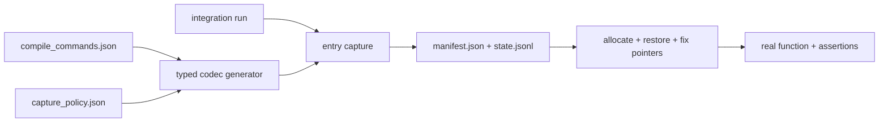

# Golden State Replay Demo

一个用于 C++ 与 GoogleTest 的最小 **golden state replay / unit-test carving**
示例。它在函数入口导出参数、选定全局根和必要对象，随后在测试进程中重建对象图并
调用真实函数。

这不是完整进程 checkpoint。平台资源和远端模块应由 adapter、stub 或 spy 接管；
fixture 只保存目标分支需要的状态切片。

仓库中的名称、URI、ID 和状态均为合成数据，不对应任何生产系统。

## 示例覆盖的关系

示例函数 `ProcessSipCallEvent()` 使用一个小型、虚构的 call-event 对象模型，演示：

- 普通值、枚举、字符串和预填充的 in/out 参数；
- 参数指向另一参数的内嵌子对象；
- `void*` handle 指向需要恢复的内部对象；
- intrusive list 保存 `&object->link` 而不是对象起始地址；
- 多个字段共享同一对象地址；
- 外部调用由 spy 记录，重要输出由选择性 oracle 比较。



## 为什么没有 `schema.json`

示例假设 capture 和 replay 代码都能看到真实 C++ 声明。类型信息由生成或手写的强类型
codec 编译进程序，因此不需要运行时解释 schema。

bundle 仍保存 `build_id`、`type_fingerprint`、pointer width 等兼容性信息。类型或
布局不匹配时 loader 必须拒绝旧 fixture。人工维护的是
[`config/capture_policy.json`](config/capture_policy.json)，它只描述 roots、遍历
边界、stub/adapter/ignore 策略和大小限制。

## 快速运行

```bash
cmake -S . -B build -DCMAKE_BUILD_TYPE=Debug
cmake --build build --parallel
ctest --test-dir build --output-on-failure

# 生成一个新的合成 bundle 并回放
./build/gsr_capture_demo /tmp/invite_200_ok.generated
./build/gsr_smoke /tmp/invite_200_ok.generated
```

CMake 优先使用已安装的 GoogleTest；找不到时固定获取 `v1.15.2`。

## Bundle

```text
examples/invite_200_ok/
  manifest.json
  state.jsonl
```

loader 分四步工作：

1. 校验 manifest 和类型指纹；
2. 分配所有完整对象；
3. 写入标量、枚举、字符串等值字段；
4. 修复普通指针、子对象指针和根绑定。

例如：

```json
{"kind":"root","name":"arg.service_ptr","to":"sip-1","subobject":"service"}
{"kind":"edge","from":"ua-1","field":"dialogs.head","to":"dialog-1","subobject":"link"}
```

分别表达 `service_ptr == &sip->service` 和 `list.head == &dialog->link`，不保存原进程
地址。完整格式见 [`docs/gsr-2.md`](docs/gsr-2.md)。

## 仓库结构

- [`examples/invite_200_ok`](examples/invite_200_ok)：合成 replay bundle。
- [`src/demo_exporter.cpp`](src/demo_exporter.cpp)：强类型入口/出口 exporter。
- [`src/replay_loader.cpp`](src/replay_loader.cpp)：强类型对象图 loader。
- [`tests/golden_state_replay_test.cpp`](tests/golden_state_replay_test.cpp)：
  GoogleTest replay、spy 和 oracle。
- [`tools/global_inventory.py`](tools/global_inventory.py)：从 Clang 编译数据库枚举
  全局变量候选；结果仍须与 capture policy 求交。

## 工程边界

- 未登记或越界指针默认拒绝，不能无界遍历进程内存。
- socket、线程、锁、TLS、vptr、函数地址和内核对象不能按原始字节恢复。
- 捕获时应保证相关对象不被其他线程同时修改。
- parser 应限制文件大小、record 数、对象数、字符串长度和总分配字节。
- URI、账号和地址等数据应在导出端 tokenization。

可参考 [BASILISK](https://arxiv.org/abs/1812.07932)、
[Boost.Serialization](https://www.boost.org/doc/libs/release/libs/serialization/doc/index.html)
和 [Metaresc](https://github.com/alexanderchuranov/Metaresc) 的 carving、pointer
tracking 与对象图序列化思路。
