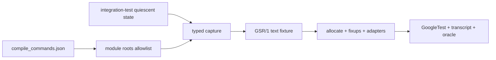

# Golden State Replay Demo

一个面向 C/C++ 与 GoogleTest 的最小 **unit-test carving / golden state
replay** 示例：在系统/集成测试的稳定时刻导出目标模块的全局根、可达堆对象和
外部交互预期，再在单元测试进程中重建对象图并执行真实业务函数。

这不是“恢复整个进程”的 checkpoint。它刻意只恢复测试所需的、经过 allowlist
筛选的状态；过远依赖和平台资源由 adapter 或 stub 接管。

## Demo 覆盖的关键问题

- 从 `compile_commands.json` 枚举目标命名空间的全局变量，再与 roots
  allowlist 求交。
- 以 `object-id + element-index` 表示指针，保留别名、环和数组内部指针。
- 分四阶段加载：分配对象、写标量/字符串、修复指针、绑定全局根。
- 不保存平台 timer 的地址，而是用稳定 token 调用 adapter 重建句柄。
- 回放示例状态迁移函数，检查外部 `stop_timer(9001)` 调用和选择性状态 oracle。
- 同时提供依赖 GoogleTest 的测试和只依赖 C++17 的 smoke runner。



## 快速运行

```bash
cmake -S . -B build -DCMAKE_BUILD_TYPE=Debug
cmake --build build --parallel
ctest --test-dir build --output-on-failure

# 模拟集成测试侧导出，再单独回放
./build/gsr_capture_demo /tmp/connected_call.generated.gsr
./build/gsr_smoke /tmp/connected_call.generated.gsr
```

如果机器没有 CMake/GoogleTest，可以先验证不依赖第三方库的核心路径：

```bash
g++ -std=c++17 -Wall -Wextra -Wpedantic -Iinclude \
  src/demo_domain.cpp src/demo_exporter.cpp src/replay_loader.cpp \
  tools/gsr_smoke.cpp -o /tmp/gsr_smoke
/tmp/gsr_smoke examples/connected_call.gsr
```

CMake 优先使用已安装的 GoogleTest；找不到时会固定拉取 `v1.15.2`。

## 从 Clang 编译数据库找全局变量

CMake 已启用 `CMAKE_EXPORT_COMPILE_COMMANDS`。安装与本机 libclang 匹配的
Python clang bindings 后运行：

```bash
python3 tools/global_inventory.py build \
  --namespace your_module \
  --source-root . \
  --output /tmp/module-globals.json
```

枚举结果只是候选集，不能直接成为 capture roots。生产实现应将其与项目维护的
roots allowlist 求交，并为每个根记录保留、递归、adapter、stub 或 ignore
策略。示例输出见
[`examples/global_inventory.json`](examples/global_inventory.json)。

## 仓库结构

- [`examples/connected_call.gsr`](examples/connected_call.gsr)：可读的 GSR/1
  fixture，包含对象、指针边、外部句柄、transcript 和 oracle。
- [`src/demo_exporter.cpp`](src/demo_exporter.cpp)：模拟集成测试侧的 typed
  exporter；显式 allocation view 代表生产中的 malloc/new registry。
- [`src/replay_loader.cpp`](src/replay_loader.cpp)：严格解析、类型检查和分阶段
  对象图重建。
- [`tests/golden_state_replay_test.cpp`](tests/golden_state_replay_test.cpp)：
  GoogleTest 回放和负向协议测试。
- [`docs/gsr-1.md`](docs/gsr-1.md)：协议、边界和工程化演进建议。

## 与已有方案的关系

- [Carving Parameterized Unit Tests / BASILISK](https://arxiv.org/abs/1812.07932)
  最接近目标：从系统执行中提取 C 单元测试，并遍历堆结构。本 demo 采用它的
  “carving”定位，但把生成代码改成稳定、可审查的文本对象图。
- [Metaresc](https://github.com/alexanderchuranov/Metaresc) 提供 C 类型反射和
  图序列化思路；可借鉴其类型元数据与多格式编码，不建议直接依赖它处理项目
  特有的外部句柄语义。
- [Boost.Serialization](https://www.boost.org/doc/libs/release/libs/serialization/doc/index.html)
  可替换 demo 的手写 value codec，并借鉴 pointer tracking/versioning；根选择、
  内存分配登记和平台 adapters 仍需项目自定义。
- [DMTCP](https://github.com/dmtcp/dmtcp) 与
  [rr](https://github.com/rr-debugger/rr) 适合完整进程 checkpoint 或确定性调试，
  可用来定位捕获时机、对照行为；它们不适合作为跨构建、可裁剪的 GTest fixture
  格式。

## 生产化前必须补齐

1. 使用 Clang 生成稳定 `type-id/field-id` 与 ABI fingerprint，不用字段名猜类型。
2. 在 allocator hook 中登记 allocation base/size/type；拒绝未登记、越界或
   one-past-end 指针。
3. 只在相关业务线程进入约定的 quiescent barrier 后捕获，避免撕裂快照。
4. 为锁、线程、socket、timer、callback、function pointer 建立明确 adapter/stub
   表，默认拒绝未知外部类型。
5. fixture 经过脱敏、大小/深度限制、校验和与 schema migration 后才能进入仓库。

协议当前是教学用的 `GSR/1` 子集；它已经证明核心对象图机制，但不是任意 C/C++
对象的通用反序列化器。
